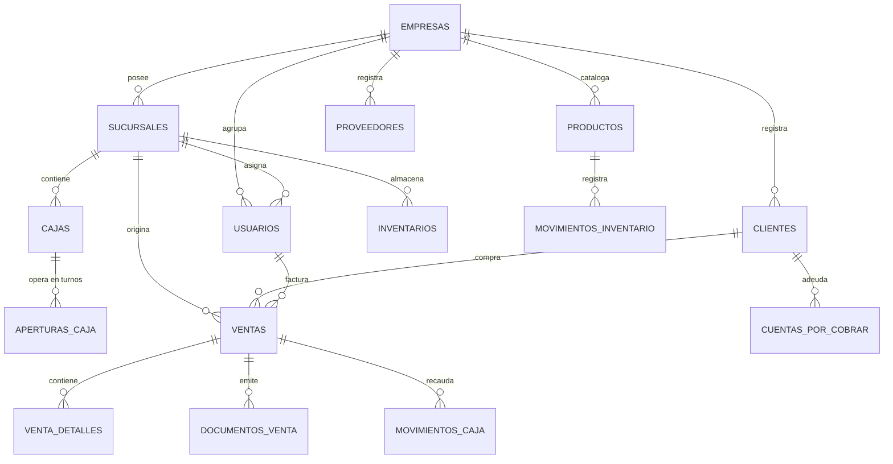

# ARQUITECTURA TÉCNICA — Sistema POS Comercial

Este documento establece los principios de diseño, arquitectura modular, modelos de datos, flujos de negocio críticos y estrategias de seguridad para el desarrollo del **Sistema POS Comercial Multiempresa**.

---

## 1. Visión General y Principios de Diseño

El sistema está diseñado como un **Monolito Modular** de alto rendimiento y estricta integridad transaccional. No se emplean microservicios en esta etapa para evitar sobrecargas de red, latencias innecesarias y complejidad operacional en puntos de venta minoristas.

### Principios Fundamentales
1. **Integridad Transaccional:** Cada operación que involucre dinero, inventario o documentos fiscales debe ejecutarse dentro de transacciones de base de datos (`DB::transaction`) y con bloqueos de fila (`lockForUpdate`) cuando exista concurrencia.
2. **Aislamiento Multiempresa por Diseño:** Todo acceso a datos de negocio debe estar protegido por un contexto empresarial inmutable obtenido desde la sesión/token autenticado, nunca desde parámetros manipulables del cliente.
3. **Kardex por Movimientos:** El stock físico nunca se modifica directamente con `UPDATE productos SET stock = x`; todo cambio de existencias debe ser la consecuencia directa de un registro en `movimientos_inventario`.
4. **Desacoplamiento Venta vs. Comprobante Fiscal:** La venta representa el hecho comercial consumado. El documento emitido (Ticket, Factura Electrónica DIAN, Documento Equivalente) es una representación fiscal que puede regenerarse, retransmitirse o emitirse de forma asíncrona sin bloquear la caja.

---

## 2. Arquitectura de Capas

El flujo de ejecución respeta una jerarquía unidireccional estricta:

```text
┌─────────────────────────────────────────────────────────────┐
│                    CAPA DE PRESENTACIÓN                     │
│         (Blade, Livewire 3, Alpine.js, Tailwind CSS)        │
└──────────────────────────────┬──────────────────────────────┘
                               │
┌──────────────────────────────▼──────────────────────────────┐
│                    CAPA DE APLICACIÓN                       │
│    (Form Requests, Livewire Components, API Controllers)    │
└──────────────────────────────┬──────────────────────────────┘
                               │
┌──────────────────────────────▼──────────────────────────────┐
│                     CAPA DE DOMINIO                         │
│  (Services, Actions, DTOs, Business Rules, Events, Enums)   │
└──────────────────────────────┬──────────────────────────────┘
                               │
┌──────────────────────────────▼──────────────────────────────┐
│                 CAPA DE INFRAESTRUCTURA                     │
│     (Jobs, Queue Workers, Notificaciones, Impresión, DIAN)  │
└──────────────────────────────┬──────────────────────────────┘
                               │
┌──────────────────────────────▼──────────────────────────────┐
│                   CAPA DE PERSISTENCIA                      │
│         (Eloquent Models, Scopes, Migrations, MySQL)        │
└─────────────────────────────────────────────────────────────┘
```

### Reglas de Capas:
- **Controladores y Componentes Livewire:** Solo orquestan entrada/salida (validan entrada con Form Requests / reglas de Livewire, invocan una `Action` o `Service` y retornan una respuesta o vista).
- **Lógica de Negocio:** Reside exclusivamente en `Actions/` (operaciones de un solo propósito) o `Services/` (procesos de dominio complejos).
- **Prohibiciones:** Cero consultas Eloquent complejas o mutaciones de inventario dentro de vistas Blade o métodos directos de renderizado Livewire.

---

## 3. Organización Modular (`app/Modules/`)

La estructura de código dentro de Laravel se organiza por módulos funcionales cohesivos:

```text
app/
├── Modules/
│   ├── Auth/                     # Autenticación, perfiles, sesiones
│   ├── Empresas/                 # Empresas (tenants), configuraciones globales
│   ├── Sucursales/               # Sucursales, asignación geográfica/operativa
│   ├── Usuarios/                 # Usuarios, perfiles y membresías
│   ├── Seguridad/                # Roles, permisos (Spatie), Gates, Policies
│   ├── Catalogos/                # Categorías, marcas, unidades de medida
│   ├── Productos/                # Catálogo de artículos, precios, códigos
│   ├── Inventario/               # Movimientos, kardex, traslados, ajustes
│   ├── Proveedores/              # Catálogo de proveedores y contactos
│   ├── Compras/                  # Órdenes y compras, recepción de stock
│   ├── Clientes/                 # Catálogo de clientes, consumidor final
│   ├── Cartera/                  # Créditos, cuentas por cobrar, abonos
│   ├── Caja/                     # Apertura, turnos, movimientos, arqueos, cierres
│   ├── Ventas/                   # Motor transaccional del carrito y venta
│   ├── POS/                      # Interfaz reactiva ultrarrápida (Livewire 3)
│   ├── Pagos/                    # Métodos de pago (Efectivo, Tarjeta, Mixto)
│   ├── Documentos/               # Generación de tickets, PDFs, numeraciones
│   ├── Impuestos/                # Reglas tributarias (IVA, Exento, Excluido)
│   ├── Reportes/                 # Métricas, KPIs, exportaciones (Excel/PDF)
│   ├── Auditoria/                # Bitácora inmutable de eventos sensibles
│   └── FacturacionElectronica/   # Integración DIAN (Fase 22) desacoplada
│
├── Actions/                      # Acciones atómicas de dominio transversal
├── Services/                     # Servicios orquestadores transversales
├── DTOs/                         # Data Transfer Objects fuertemente tipados
├── Enums/                        # Enumeraciones de estado, tipos de movimiento, etc.
├── Policies/                     # Autorización por recurso
└── Support/                      # Clases base, macros, helpers
```

---

## 4. Estrategia Multiempresa (Multi-tenancy)

El sistema opera bajo el modelo **Single Database Multi-tenant** con segregación lógica mediante `empresa_id`.

```text
              ┌───────────────────────────────┐
              │      Petición HTTP / Token    │
              └───────────────┬───────────────┘
                              │
                    ┌─────────▼─────────┐
                    │ Middleware Tenant │
                    │  (CompanyContext) │
                    └─────────┬─────────┘
                              │
         Valida membresía de usuario en la empresa
                              │
                    ┌─────────▼─────────┐
                    │ Trait de Modelo   │
                    │ BelongsToCompany  │
                    └─────────┬─────────┘
                              │
   Aplica automáticamente: WHERE empresa_id = CompanyContext::id()
   Asigna automáticamente en creación: $model->empresa_id = CompanyContext::id()
```

### Reglas de Seguridad Multiempresa:
1. **Inyección Cero de `empresa_id`:** Ningún formulario, payload JSON o endpoint de API aceptará `empresa_id` como parámetro mutable del usuario.
2. **Global Scopes:** Todos los modelos con datos sensibles implementan el trait `BelongsToCompany`, inyectando el `GlobalScope` en cada `SELECT`, `UPDATE` o `DELETE`.
3. **Super Admin Isolation:** Si un usuario con rol `SUPER_ADMIN` requiere realizar tareas de soporte, debe realizar un "Switch Context" explícito y auditado, nunca ejecutar consultas cross-tenant descontroladas.

---

## 5. Entidades Base y Relaciones Fundamentales



---

## 6. Flujos Transaccionales Críticos

### 6.1. Flujo de Venta Transaccional
```text
1. POS recibe items del carrito, cliente y método(s) de pago.
2. Inicia DB::beginTransaction().
3. Verifica turno de caja abierto para el usuario/sucursal (row lock).
4. Para cada ítem:
   a. SELECT producto WHERE id = ? FOR UPDATE.
   b. Verifica stock disponible >= cantidad solicitada.
   c. Calcula base imponible, porcentaje de impuesto y descuentos.
5. Inserta registro maestro en 'ventas'.
6. Inserta registros en 'venta_detalles'.
7. Registra movimiento en 'movimientos_inventario' (Tipo: SALIDA_VENTA).
8. Actualiza acumuladores de stock en tabla de inventario por sucursal.
9. Registra ingreso en 'movimientos_caja' (o genera 'cuentas_por_cobrar' si es a crédito).
10. Inserta registro inicial en 'documentos_venta' (Tipo: TICKET, Estado: EMITIDO).
11. Genera evento de dominio 'VentaRealizada'.
12. DB::commit().
13. Listener encolado envía datos a servicio de impresión o cola de facturación.
```

### 6.2. Flujo de Inventario (Kardex Inmutable)
```text
Movimiento (Compra, Venta, Ajuste, Traslado)
   │
   ├─► 1. Bloqueo pesimista del stock actual (lockForUpdate)
   ├─► 2. Captura: stock_anterior
   ├─► 3. Aplica variación (+ o - cantidad)
   ├─► 4. Captura: stock_posterior
   ├─► 5. Inserta fila inmutable en 'movimientos_inventario'
   └─► 6. Emite alerta si stock_posterior <= stock_minimo
```

### 6.3. Flujo de Control de Caja
```text
Apertura (Monto inicial verificado)
   │
   ├─► Operación de turno (Ventas en efectivo, tarjetas, transferencias, egresos manuales)
   │     - Cada centavo se asocia a la apertura_caja_id activa
   │
   ├─► Pre-cierre / Arqueo ciego:
   │     - Cajero ingresa el conteo físico de dinero en gaveta sin ver el cálculo del sistema
   │
   └─► Cierre definitivo:
         - Sistema calcula: Monto Esperado = Saldo Inicial + Entradas - Salidas
         - Diferencia = Conteo Físico - Monto Esperado
         - Guarda estado 'CERRADA' y notifica si la diferencia supera la tolerancia
```

---

## 7. Modelo de Seguridad y Autorización

### Roles Estándar:
- `SUPER_ADMIN`: Administrador técnico de la plataforma.
- `ADMIN_EMPRESA`: Propietario o administrador general del negocio (acceso completo a su tenant).
- `ADMIN_SUCURSAL`: Encargado de punto de venta (administra inventario y cajas de su sucursal).
- `CAJERO`: Operador de punto de venta (solo POS, apertura/cierre de su caja, cobros).
- `VENDEDOR`: Asesor de ventas (cotizaciones, pedidos, no accede a dinero).
- `CONTADOR`: Auditor financiero (reportes, libros de venta/compra, cuentas por cobrar/pagar).

### Estrategia de Permisos:
- Paquete: `spatie/laravel-permission`.
- Autorización granular mediante **Laravel Policies** vinculadas a modelos.
- Rate limiting en autenticación y operaciones de emisión de ventas.

---

## 8. Arquitectura de API (`/api/v1`)

- **Autenticación:** Laravel Sanctum con tokens de acceso personal con capacidades (`abilities`).
- **Control de Acceso:** Middleware de autenticación e inyección obligatoria del contexto `CompanyContext`.
- **Estandarización de Respuestas:** Uso de API Resources y formato JSON unificado:
  ```json
  {
    "success": true,
    "data": {},
    "message": "Operación exitosa"
  }
  ```

---

## 9. Desacoplamiento para Facturación Electrónica DIAN (Fase 22)

Para asegurar que la integración futura con la DIAN no comprometa la velocidad del POS:

1. **Patrón Adapter / Driver:**
   - Se creará una interfaz `FacturacionElectronicaServiceInterface`.
   - Implementaciones concretas para proveedores tecnológicos (ej. The Factory HKA, Factus, Siigo o servicio directo SOAP/DIAN) sin alterar la lógica de negocio.
2. **Asincronía mediante Queues:**
   - La venta se confirma inmediatamente al cajero.
   - Un Job en cola (`EmitirFacturaElectronicaJob`) toma el `DocumentoVenta`, arma el XML UBL 2.1, lo firma, lo transmite y almacena el CUFE y QR al recibir respuesta.
3. **Resiliencia ante Caídas de la DIAN:**
   - Si la DIAN o el proveedor tecnológico no responden, el documento queda en estado `PENDIENTE_TRANSMISION` y el POS emite el comprobante contingencia sin detener la fila de clientes.
